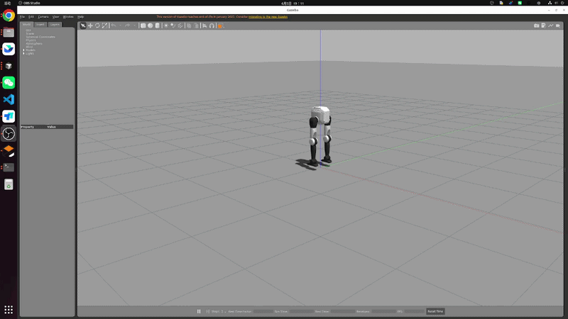
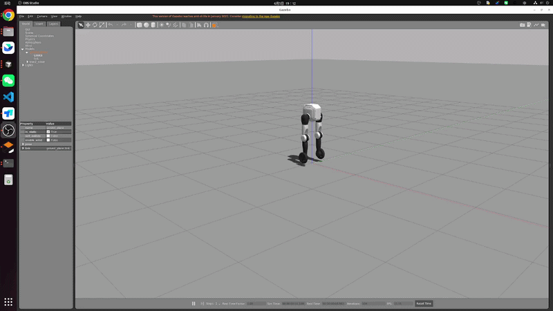
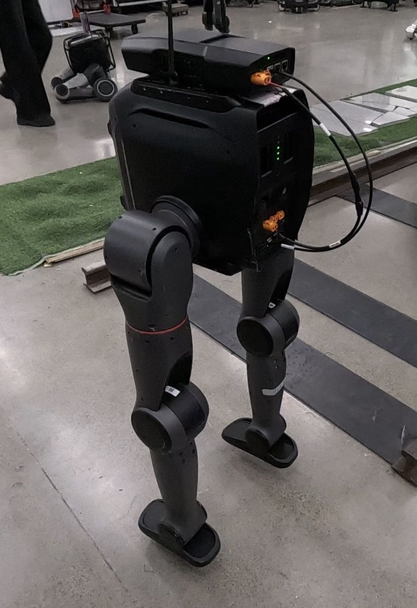

# English | [中文](README_cn.md)

<!--
  SPDX-FileCopyrightText: 2024-2026 LimX Dynamics Technology Co., Ltd.
  SPDX-License-Identifier: Apache-2.0
-->

[English](README.md) | [中文](README_zh-CN.md)

> **Distribution.** The primary distribution of this repository is
> [`github.com/limx-tron2/tron2-rl-deploy-ros`](https://github.com/limx-tron2/tron2-rl-deploy-ros).
> LimX's internal GitLab hosts a mirror; please open issues and pull
> requests on GitHub.

# TRON2 ROS workspace (`~/limx_ws/src`)

This directory is the TRON2 source space (catkin `src`) under ROS Noetic. It contains both simulation-side and control-side packages.

## License & attribution

This project is licensed under the **Apache License, Version 2.0**
(January 2004) at the repository top level. See the [`LICENSE`](LICENSE)
file for the full text. SPDX identifier: `Apache-2.0`.

- [`NOTICE`](NOTICE) — required attribution notice, and the list of
  in-tree artifacts whose license status is **not** yet covered by
  the top-level Apache-2.0 grant.
- [`THIRD_PARTY_NOTICES.md`](THIRD_PARTY_NOTICES.md) — per-artifact
  provenance and every `⚠ TO CONFIRM` item.
- [`SECURITY.md`](SECURITY.md) — how to report a vulnerability, plus
  real-hardware safety notes.
- [`CONTRIBUTING.md`](CONTRIBUTING.md) — ROS C++ workflow, model /
  weight provenance checklist, binary artifact policy, DCO sign-off.
- [`CHANGELOG.md`](CHANGELOG.md) — release notes, including the
  "Pending owner sign-off" list that blocks the first public tag.

## Scope / not included

**Included** in this repository:

- Four ROS packages: `tron2_hw`, `tron2_controllers`, `robot_common`,
  `onnxruntime_sdk`.
- Launch files for Gazebo simulation and real-hardware bring-up.
- Configuration for the `SF_TRON2A` and `WF_TRON2A` variants.

**Included but pending owner clearance** (see `THIRD_PARTY_NOTICES.md`):

- `onnxruntime_sdk/lib/libonnxruntime.so` and `libonnxruntime.so.1.10.0`
  (bundled ONNX Runtime binary, ~14.3 MB — vendor clearance and
  SHA-256 recording pending).
- `tron2_controllers/config/SF_TRON2A/policy/{policy,encoder}.onnx`
  and `tron2_controllers/config/WF_TRON2A/policy/{policy,encoder}.onnx`
  (RL policy / encoder weights — model owner and robot-safety owner
  clearance pending).
- `tron2_hw/package.xml` and `tron2_controllers/package.xml` currently
  declare `<license>Proprietary</license>`; `robot_common/package.xml`
  and `onnxruntime_sdk/package.xml` currently declare
  `<license>TODO</license>` — legal / OSPO review pending.

**Excluded — by design:**

- No firmware or bootloader artifacts.
- No factory-calibration values (per-serial or global offsets).
- No motion / bag data (`*.bag`, `*.mcap`, HDF5 trajectory captures).
- No customer-specific or site-specific configuration.
- No auto-start behaviour on real hardware — bring-up always
  requires an explicit operator action; see `SECURITY.md`.

Real-hardware bring-up details, including start / stop / emergency-stop
service names, are documented in `tron2_hw/docs/bringup_mvp.md` and
are pending robot-safety owner sign-off before public release.

## 1. Directory layout

The recommended layout is:

```text
~/limx_ws/src
├── CMakeLists.txt                 # catkin top-level entry (usually a symlink)
├── robot-description              # Robot URDF / description package (top-level under src)
├── limxsdk-lowlevel               # Low-level SDK package (top-level under src)
├── tron2-gazebo-ros               # Simulation-related package group
│   ├── limxsdk-sim
│   └── tron2_gazebo
└── tron2-rl-deploy-ros            # Control / deployment package group
    ├── onnxruntime_sdk
    ├── robot_common
    ├── tron2_controllers
    └── tron2_hw
```

> Note: catkin discovers packages recursively, so the sub-directory grouping does not affect the build as long as every ROS package contains a valid `package.xml` and `CMakeLists.txt`.

## 2. Requirements

- Ubuntu 20.04
- ROS Noetic (`ros-noetic-desktop-full` recommended)
- Gazebo 11 (default with ROS Noetic)
- Common dependencies (install as needed):

```bash
sudo apt-get update
sudo apt-get install -y \
  ros-noetic-gazebo-ros-pkgs \
  ros-noetic-gazebo-ros-control \
  ros-noetic-ros-control \
  ros-noetic-ros-controllers \
  ros-noetic-controller-manager \
  ros-noetic-joint-state-controller \
  ros-noetic-rqt-controller-manager \
  ros-noetic-robot-state-publisher \
  libeigen3-dev
```

## 3. Build

Run from the workspace root:

```bash
cd ~/limx_ws
source /opt/ros/noetic/setup.bash
catkin_make
```

After a successful build, load the workspace environment:

```bash
source ~/limx_ws/devel/setup.bash
```

## 4. Running the examples

### 4.1 Launch the simulation (full deployment)

```bash
cd ~/limx_ws
source /opt/ros/noetic/setup.bash
source devel/setup.bash
# Launch the full stack: Gazebo world, hardware node, and controllers.
roslaunch tron2_hw tron2_hw_sim.launch robot_type:=SF_TRON2A
```

`robot_type` can be switched to match your configuration (e.g. `SF_TRON2A` / `WF_TRON2A`).

### 4.2 Launch only the controller (simulation mode)

If you have already brought up a Gazebo world manually, you can start just the hardware node and the controllers:

```bash
roslaunch tron2_hw tron2_controller_sim.launch robot_type:=SF_TRON2A
```

### 4.3 Real-hardware deployment

```bash
roslaunch tron2_hw tron2_hw.launch robot_type:=SF_TRON2A robot_ip:=<robot-ip>
```

**Note on `<robot-ip>`.** The `<robot-ip>` token in shipped command
examples is a placeholder — substitute your robot's actual IP
before running. The source-side default values in
`tron2_hw/src/Tron2HW.cpp`, `tron2_hw/src/tron2_hw_node.cpp`, and
the launch argument default in `tron2_hw/launch/tron2_hw.launch`
retain the literal `10.192.1.2` as a documentation example
describing typical real-hardware usage. This is a documentation
value only and is not the address of any LimX production network.
See [`SECURITY.md`](SECURITY.md) and
[`THIRD_PARTY_NOTICES.md`](THIRD_PARTY_NOTICES.md) §7 for the
private-IP handling policy.

## 5. Simulation vs real-hardware logic (important safety notes)

Bottom line: **the core control chain is identical**, and in both cases it is:

- `tron2_hw_node` (`Tron2HW`) -> `RobotHWLoop` -> `controller_manager` -> `tron2_controller`

The two modes only differ on the input side:

- Simulation (`tron2_hw_sim.launch`) additionally publishes `/cmd_vel` and `/tron2_controller/set_mode` by default.
- Real hardware (`tron2_hw.launch`) receives its inputs mainly through the SDK-subscribed channels.

Real-hardware bring-up must always be an explicit, supervised operator action. Keep the robot suspended when starting the controller, and know where the emergency-stop is before enabling the `controller_manager`. See `tron2_hw/docs/bringup_mvp.md` and `SECURITY.md`.

## 6. Configuration file locations

The primary control parameters live in:

- `tron2-rl-deploy-ros/tron2_controllers/config/SF_TRON2A/params.yaml`
- `tron2-rl-deploy-ros/tron2_controllers/config/WF_TRON2A/params.yaml`

## 7. Screenshots / GIFs

### 7.1 Simulation deployment




### 7.2 Real-hardware deployment

Always suspend the robot before starting the controller during real-hardware deployment.




## 8. FAQ

- Launch fails with "package not found":
  - Make sure you have run `source /opt/ros/noetic/setup.bash`.
  - Make sure you have run `source ~/limx_ws/devel/setup.bash`.
- Build fails after moving directories:
  - Re-run `catkin_make` from `~/limx_ws`.
- Gazebo plugin / controller fails to load:
  - Confirm that `tron2_gazebo`, `tron2_hw`, and `tron2_controllers` all built successfully first.

## Verification

The commands below mirror the CI workflow at
[`.github/workflows/ci.yml`](.github/workflows/ci.yml). Running them
locally before opening a PR saves review round-trips.

```bash
# 1. Build succeeds against the sibling workspace
cd ~/limx_ws
source /opt/ros/noetic/setup.bash
catkin_make

# 2. Every package.xml is well-formed
xmllint --noout $(find . -name 'package.xml')

# 3. Every unresolved <license> line still carries the ⚠ TO CONFIRM
#    annotation (CI fails if any silently loses the annotation).
find . -name 'package.xml' -exec grep -Hn '<license>' {} \;

# 4. No uncontrolled binaries / weights / bags. The output must exactly
#    match the pre-existing controlled set in THIRD_PARTY_NOTICES.md.
git ls-files | grep -iE '\.(onnx|pt|pth|ckpt|so(\.[0-9.]+)?|dll|dylib|lib|whl|bag|mcap)$'

# 5. Private-IP scan (only the documented example 10.192.1.2 is allowed;
#    Markdown/YAML examples should use the <robot-ip> substitution token).
grep -RIn --exclude-dir=.git -E \
  '\b(10\.[0-9]+\.[0-9]+\.[0-9]+|192\.168\.[0-9]+\.[0-9]+)\b' .
```

## Cite & support

If you use this deployment stack in academic or public work, please
cite the repository:

```
@misc{limx_tron2_rl_deploy_ros_2026,
  title  = {TRON2 RL deployment for ROS},
  author = {LimX Dynamics},
  year   = {2026},
  howpublished = {\url{https://github.com/limx-tron2/tron2-rl-deploy-ros}}
}
```

- **Bug reports / feature requests:** [GitHub Issues](https://github.com/limx-tron2/tron2-rl-deploy-ros/issues).
- **Questions / integration help:** [GitHub Discussions](https://github.com/limx-tron2/tron2-rl-deploy-ros/discussions).
- **Security or robot-safety reports:** email `contact@limxdynamics.com`
  with subject prefix `[tron2-rl-deploy-ros]`; see [`SECURITY.md`](SECURITY.md).
- **Company / commercial contact:** <https://www.limxdynamics.com>.
